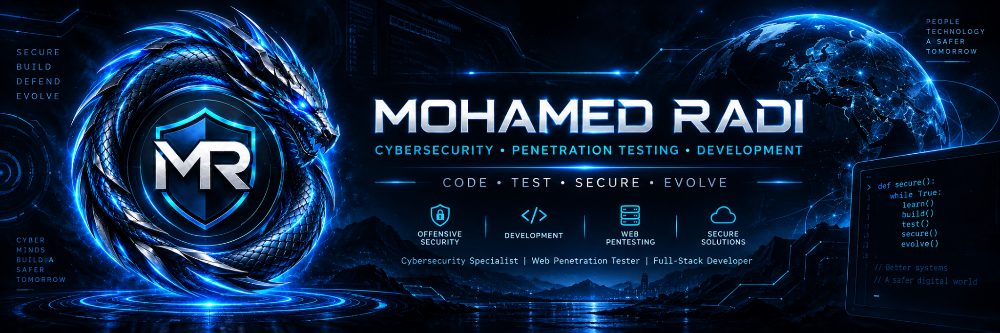

  

# ⚡ MOHAMED RADI — DIGITAL ENGINEERING SHOWCASE

### `CYBERSECURITY • SECURE FULL-STACK • AUTOMATION • INFRASTRUCTURE`

[Live Portfolio](https://mohamedradi.is-a.dev) •
[GitHub](https://github.com/deadsquad21) •
[LinkedIn](https://www.linkedin.com/in/mohamedradi-cybersecurity) •
[ORCID](https://orcid.org/0009-0007-9464-5246)

---

## Purpose

This public repository is a **showcase and engineering documentation layer** for Mohamed Radi's professional portfolio.

It does **not** publish private client source code. It documents selected systems, engineering focus areas, screenshots approved for public use, architecture notes that are safe to disclose, and verified live links.

## Professional Focus

- Cybersecurity & Web Application Security
- Web Penetration Testing in authorized environments
- Secure Full-Stack Development
- Technical SEO & Performance
- Infrastructure & Deployment
- Automation & AI-assisted Workflows
- Analytics & Digital Optimization

## Selected Systems

| Project | Type | Public Status | Notes |
|---|---|---:|---|
| Mohamed Radi Portfolio | Professional platform | Live | Official personal ecosystem |
| KemetX Tours | Tourism platform | Live | Separate public showcase |
| Crazy Adventures | Tourism platform | Pending verification | Publish only after URL/rights check |
| Warner Tours | Tourism platform | Pending verification | Publish only after URL/rights check |
| [Cybersecurity Lab](https://github.com/deadsquad21/cybersecurity-lab) | Security engineering | Live / Public | Public authorized lab |

## Showcase Rules

1. Never expose private repository source code.
2. Never publish credentials, API keys, client data, analytics exports, or infrastructure secrets.
3. Use only screenshots and information approved for public release.
4. Label concept work, private systems, demos, and live systems accurately.
5. Do not publish performance or business metrics unless they are measured and approved.

See [`docs/public-showcase-policy.md`](./docs/public-showcase-policy.md).

## Live Identity

**Portfolio:** https://mohamedradi.is-a.dev  
**Business:** contact@mohamedradi.is-a.dev  
**General:** info@mohamedradi.is-a.dev

### MR — SECURE DIGITAL SOLUTIONS
`CODE • TEST • SECURE • EVOLVE`

